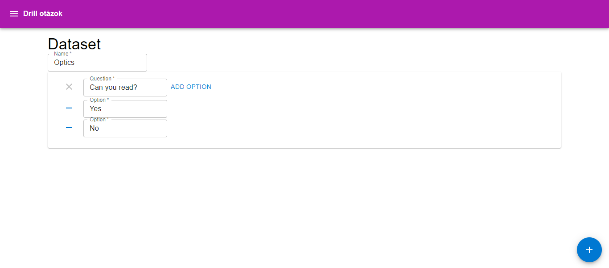

# Questions Drill App

This React app is designed for managing questionnaire testing. It provides functionalities for creating, editing, importing, and deleting datasets. The app follows a structured routing system to navigate between different pages.

## Features
- Main Page:
  - Overview of available datasets
  - Quick access to essential actions

- Dataset Page:
  - Detailed view of a specific dataset
  - Allows for in-depth examination and modification

- Form Page:
  - Create a new dataset using a form
  - Capture relevant details and questions

- Import Page:
  - Import datasets from external sources
  - Streamline the process of incorporating existing data

- Delete Page:
  - Permanently remove datasets from the system
  - Confirm deletion through a structured process

## Getting Started

1. Clone the Repository:
```
git clone https://github.com/your-username/questionnaire-testing-app.git
cd questionnaire-testing-app
```

2. Install Dependencies:
Ensure that Node.js and npm are installed on your machine.
```npm install```

3. Run the App:
```npm start```

The app will be accessible at http://localhost:3000/.

## Project Structure

The project follows a routing system created using the `react-router` library. Key components and actions are organized based on their functionality.

- Components:
  - `App`: The main application component.
  - `MainPage`: Component for the main overview page.
  - `DatasetPage`: Component for the detailed view of a dataset.
  - `FormPage`: Component for creating a new dataset.
  - `ImportPage`: Component for importing datasets.
  - `DeletePage`: Component for deleting datasets.

- Actions:
  - `formAction`: Action associated with the form submission.
  - `deleteAction`: Action associated with the deletion process.

## Screenshots



## License
This project is licensed under the [MIT License](LICENSE).

## TODO

1. Multichoice questions
2. Import own JSON dataset
